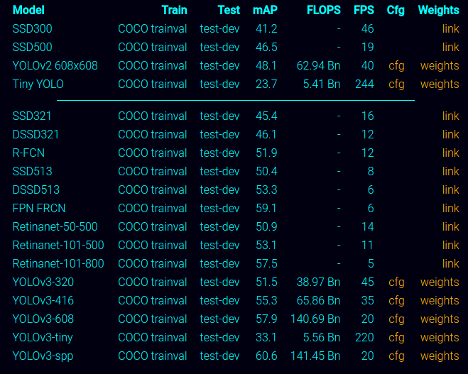
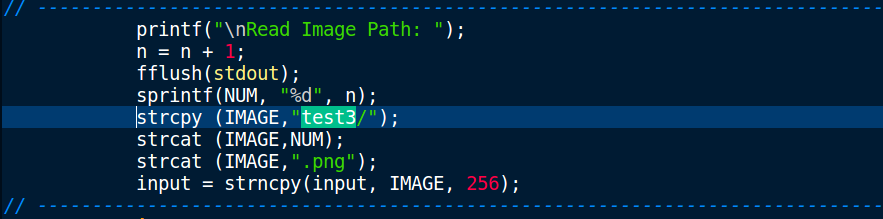
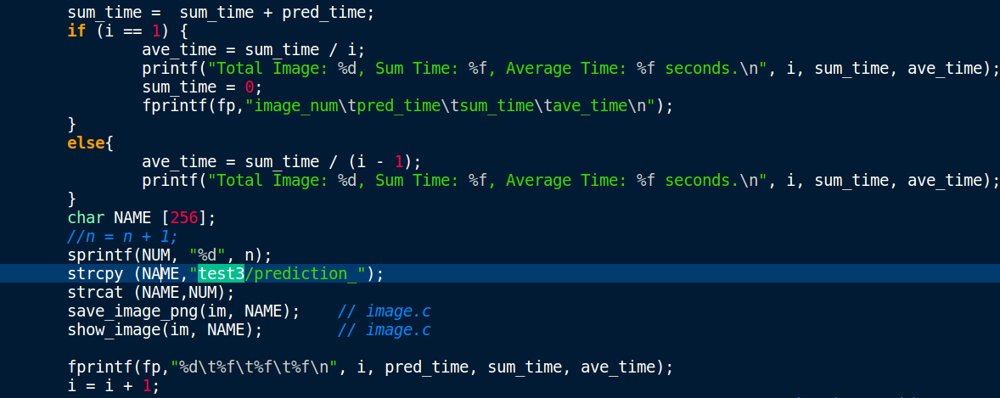
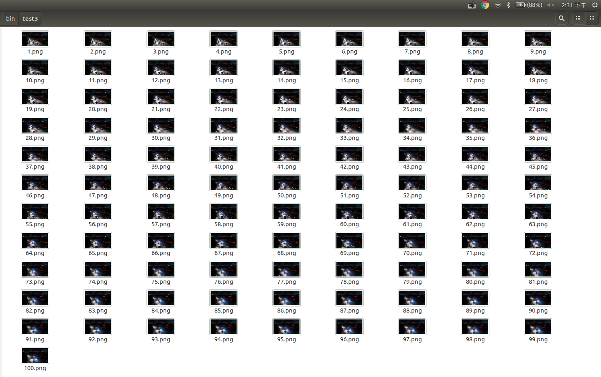

# IV. Darknet-Cross Commands

## 1. Compiling 

The commands used for compiling are listed in the previous introduction.

[Ubuntu-CPU Version](https://github.com/huuuuusy/Darknet-Cross/blob/master/introduction/User_Guide_Ubuntu.md#11-ubuntu-cpu-version)

[Ubuntu-CUDA Version](https://github.com/huuuuusy/Darknet-Cross/blob/master/introduction/User_Guide_Ubuntu.md#123-ubuntu-cuda-version-compile)

[Ubuntu-OpenCL Version](https://github.com/huuuuusy/Darknet-Cross/blob/master/introduction/User_Guide_Ubuntu.md#133-ubuntu-opencl-version-compile)

[Android-CPU Version](https://github.com/huuuuusy/Darknet-Cross/blob/master/introduction/User_Guide_Android.md#23-android-cpu-version)

[Andorid-OpenCL Version](https://github.com/huuuuusy/Darknet-Cross/blob/master/introduction/User_Guide_Android.md#24-andorid-opencl-version)

## 2. Test

### 2.1 Model Choose

I've uploaded the configuration and weights files for YOLO-V3-Tiny in bin folder. For other YOLO models based on Darknet, you can download the related files from [Darknet offical website](https://pjreddie.com/darknet/yolo/).

### 2.2 Image Test

This command can be used in both Ubuntu and Android platform.

	./darknet detector test coco.names yolov3-tiny.cfg yolov3-tiny.weights -thresh 0.24 dog.jpg

You should change the **yolov3-tiny.cfg yolov3-tiny.weights** to suit the model files you've downloaded.

By default, YOLO only displays objects detected with a confidence of .25 or higher. You can change this by passing the -thresh <val> flag to the yolo command.

### 2.3 Video Test

This command is used in Ubuntu platform with OpenCV.

	./darknet detector demo coco.names yolov3-tiny.cfg yolov3-tiny.weights test1.mp4

### 2.4 Multi-Image Test

This command can be used in both Ubuntu and Android platform.

	./darknet detector test coco.names yolov3-tiny.cfg yolov3-tiny.weights

The executable file will peocess images in test3 folder one by one. If you want to change the folder, please follow these steps:

(1) Open main.c file, use Ctrl+F to find all 'test3'.

(2)Change 'test3' to the name of new test folder.

(3)Make sure the images in new folder have same naming rules as test3. (number.png)

(4)Re-compiling the executable file.
