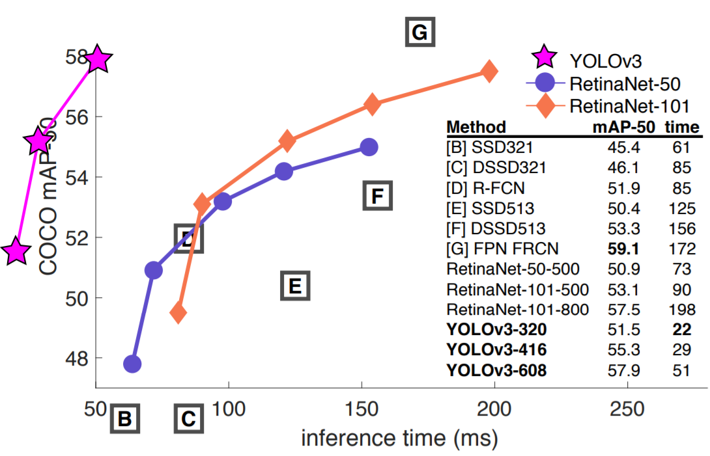
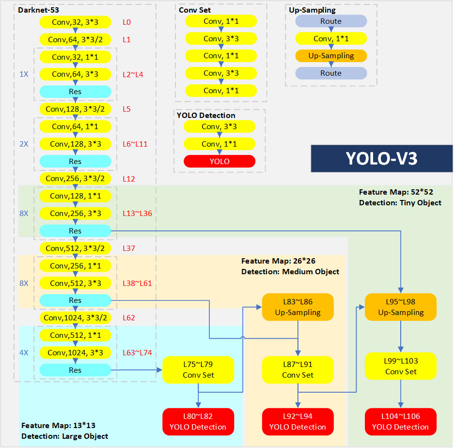
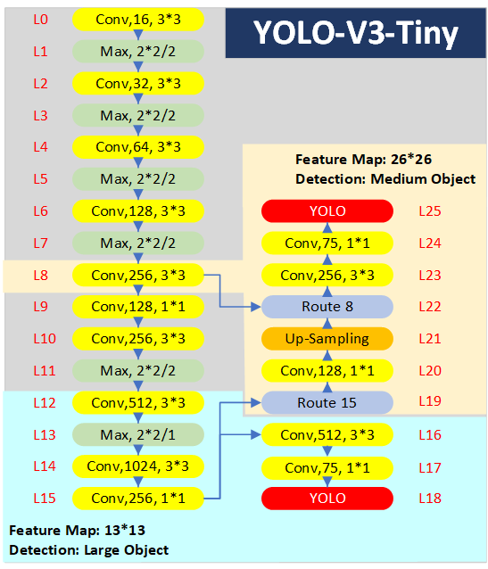
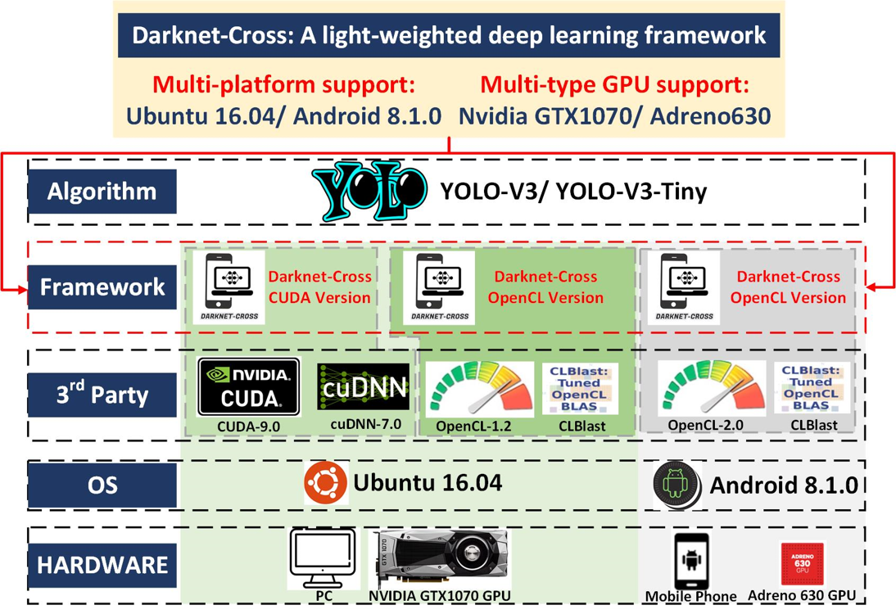

# Darknet-Cross Introduction

Darknet-Cross is a lightweight deep learning framework based on [Darknet](https://github.com/pjreddie/darknet) and [yolov2_light](https://github.com/AlexeyAB/yolo2_light).

## Framework Compare

### Original Darknet

The original [Darknet](https://github.com/pjreddie/darknet) framework is a relatively light-weighted and open-source deep learning framework based on C and CUDA written by YOLO authors. Its main feature is easy to install with few dependencies, so the portability of Darknet is wonderful. Darknet framework supports NVIDIA GPU acceleration.

Darknet is designed for providing acceleration of YOLO algorithm. YOLO is the representative of one-stage object detection algorithm. The V1 version was released in 2015, and the latest version is the V3 version released in April 2018. Compared with other object detection algorithms, YOLO-V3 can better balance the accuracy (Index: mAP) and processing speed (Index: FPS).

### yolov2_light

The [yolov2_light](https://github.com/AlexeyAB/yolo2_light) framework is a light-weighted version of Darknet. It only remains the code that supports object detection in Darknet, and provides the OpenCL version for YOLO-V2 computation acceleration in Windows system. 

### Darknet-Cross

Darknet-Cross provides computation acceleration for multi-platform (Eg.Ubuntu/Android) and multiple types of GPUs (Eg. Nvidia GTX1070/ Adreno 630).

The following image lists the differences between the original Darknet, the YOLOV2-Light and the Darknet-Cross.

## YOLO-V3 Model

Darknet-Cross provides GPU-based acceleration for the YOLO-V3 algorithm. YOLO-V3 has a sophisticated network structure, which absorbs the structural advantages of numerous classical deep neural networks. As a object detection algorithm, it can achieve a balance between accuracy and recognition speed.

YOLO-V3 has the following advantages:

**For increasing [mAP(Mean Average Precision)](https://www.youtube.com/watch?v=pM6DJ0ZZee0)**： YOLO-V3-608 has 57.9 mAP value on COCO in 0.5 IoU.

1. YOLO-V3 uses Darknet-53 as backbone. Darknet-53 uses the residual structure to solve the degradation problem during DNN training, ensuring that YOLO-V3 can be well trained to improve accuracy.
2. YOLO-V3 uses the [FPN (Feature Pyramid Networks)](https://arxiv.org/abs/1612.03144) structure for target detection, which can learn features in three different scales to ensure the accuracy of small target detection.
3. YOLO-V3 is a [FCN (Fully Convolutional Networks)](https://people.eecs.berkeley.edu/~jonlong/long_shelhamer_fcn.pdf) structure and avoids the use of pooling layers to prevent features loss during training.
4. YOLO-V3 uses 9 anchor boxes for each cell in target detection, significantly improving IoU.  

**For increasing [FPS(Frame Per Second)](https://en.wikipedia.org/wiki/Frame_rate)**: YOLO-V3-320 has 45FPS and YOLO-V3-Tiny has 220FPS in Titan X.

1. Darknet-53 uses a series of 3*3 and 1*1 convolution kernels to reduce the number of parameters involved in convolution calculations for increasing FPS.
2. YOLO-V3 normalizes the input image to achieve batch processing and generates tensors that can be accelerated by GPU to improve FPS.
3. YOLO-V3 provides Tiny version to further enhance FPS while retaining the advantages of YOLO-V3 structure. 

## Darknet-Cross Function

Darknet-Cross is a light-weighted DL framework designed for multi-platform and multi-GPU. It provides the following versions:

**For Ubuntu platform:**

- Darknet-Cross CUDA Version
- Darknet-Cross OpenCL Version

**For Android platform:**

- Darknet-Cross OpenCL Version

Darknet-Cross uses [OpenCL](https://www.khronos.org/opencl/) to invoke GPU devices, and uses [CLBlast](https://github.com/CNugteren/CLBlast) as the BLAS library to accomplish the  Linear Algebra computation acceleration in deep neural network layers.

