# V. Darknet-Cross Performance

# 1. Foreword: Relationship of DNN model, DL Framework and Hardware Environment

Before the test part, I want to illustrate my personal understanding of the relationship between DNN model, DL framework and hardware platform.

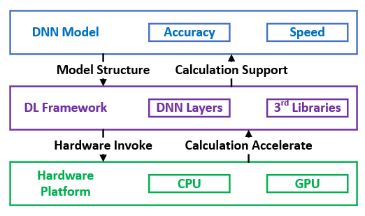

## 1.1 DNN Model

The DNN model is the algorithm you designed to solve a specific problem, such as you can design the 107 DNN layers YOLO-V3 model or 27 DNN layers YOLO-V3-Tiny model to accomplish the object detection task. The model itself has many advantages like using multiple small convolution kernels, Darknet-53 backbone and FPN structure. All of these wonderful features concern the model structure and do not have direct relationship with framework or platform. For example, YOLO, RCNN, Fast RCNN and Mask RCNN are DNN models, and the YOLO-V3 has better balance between the accuracy and process speed in object detection task among these models.

## 1.2 DL Framework

The DL framework includes the source code files to rebuild the DNN model, and cooperates  with 3rd parties to provide the hardware support. A specific DNN model can be rebuilt on different DL frameworks. TensorFlow, Caffe, PyTorch and Caffe2 are famous DL frameworks, and you can rebuild YOLO-V3 by choosing one framework. 

Darknet is also a DL framework. Although YOLO-V3 can be rebuilt on other frameworks, the Darknet provided by the same author will provide better support for YOLO-V3, since it is written in C language with less dependencies. 

## 1.3 Hardware Platform

CPU and GPU are the usual computation devices in platforms to support calculation. CPU is designed for complex computing while GPU is used for simple but vast floating-point computing. In DL framework, 3rd parties like CUDA or OpenCL are used to invoke GPU for improving the computation speed.

## 1.4 Conclusion

In conclusion, for object detection task:

- The DNN model is mainly responsible for the accuracy, since different structure of the model will influence the feature extraction process, which is necessary for the accuracy in object detection. What's more, some structure features like using small kernels to replace the large convolution kernel can reduce the calculated amount, which will increase the FPS as well.

- The framwork is important in practical usage. Framework like TensorFlow is well-deveolped and provides multiple layer typies and functions to rebuild the DNN model. This feature helps TensorFlow become the most famous DL framework for developers to use, but may not suit a specific practical issue. For tasks like real-time object detection, we hope the framework to become light-weighted and compact, to make sure the executable file can accomplish higher FPS in detection. Thus, this is why the Darknet framework may suit YOLO-V3 than other famous frameworks.

- The Darknet-Cross framework is based on the Darknet framework. It deletes the useless functions to make sure the framework is light-weighted, and adds the multi-platform and multi-type GPU support. Since the Darknet-Cross is an improved-version of Darknet, it can use the configutation and weight files provided by the Darknet official website directly (other frameworks like TensorFlow and Caffe need to transfer the model files at first). This means that the **Darknet-Cross has the same accuracy as Darknet (since they all use the same model files, and the codes about DNN layers and prediction process are also same) and higher FPS in actual process (will be tested in the following parts)**.

## 2. Test Environment

### 2.1 Platform

The performance tests are completed in Ubuntu 16.06 and Android 8.1 platform with specific indexes shown in the image.

### 2.2 Data

#### 2.2.1 Single Image Data

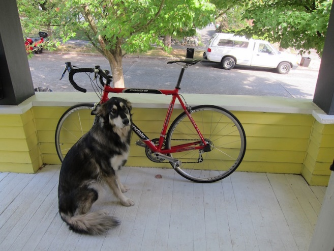

|Name|Source|Format|Usage|
|:--:|:--:|:--:|:--:|
|dog.jpg|[Darknet official website](https://pjreddie.com/darknet/yolo/)|768*576 RGB image|object detection test in single image|

#### 2.2.2 Video Data

|Name|Source|Format|Duration|Size|
|:--:|:--:|:--:|:--:|:--:|
|[Test1.mp4](https://drive.google.com/open?id=1CU4PIWpXPMsFdbJ8xtMX8AjwoF9xjHIA)|Udacity|MP4|00:00:50|1280*720|
|[Test2.mp4](https://drive.google.com/open?id=1t9NUVHbatGlId5yZuB9feyrcwzAiKeeA)|Videezy|MP4|00:00:30|1280*720|
|[Test3.mp4](https://drive.google.com/open?id=1QmH1vcW6vGev16jAZ2VkvPP4_SKSHUqY)|Videezy|MP4|00:02:39|1280*720|

These three files are used to test the video process ability of Darknet-Cross in Ubuntu platform.

#### 2.2.3 Multi-Image Data

The multi-image data comes from the test video. The process steps are as following:

- Extract all the frames in test1.mp4, test2.mp4 and test3.mp4 by using OpenCV-3.4.0
- Retain the first 900 frames in each test video and form corresponding multi-image test dataset

## 3. Detailed Information for Experiments

I've designed 38 experiments to test the comprehensive performance of the Darknet-Cross framework. The Darknet framework means the [original Darknet](https://github.com/pjreddie/darknet), which can be downloaded and installed according to the github page.

All the experiment numbers used in the following page are equal to the number in this table.

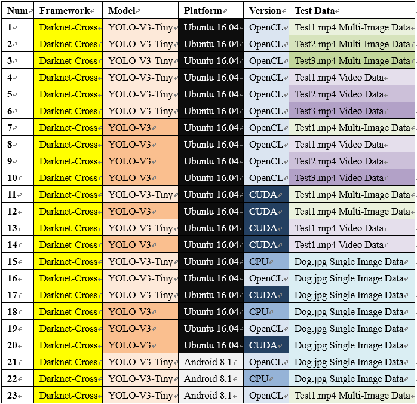
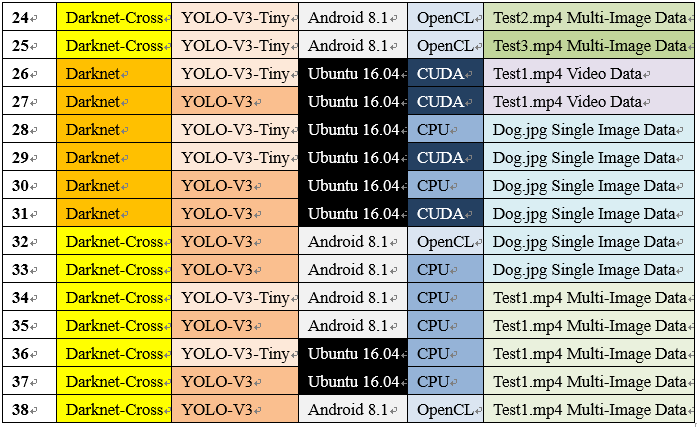

## 4. Multi-framework Test (Darknet-Cross vs. Darknet)

This chapter is designed to compare the performance of these two frameworks. Since I've illustrated the accuracy of these two framework is same in [1.4 Conclusion](https://github.com/huuuuusy/Darknet-Cross/blob/master/introduction/Performance.md#14-conclusion), the following results will demonstrate Darknet-Cross is a light-weighted framework with higher FPS.

**This chapter compares two frameworks in Ubuntu platform (since Android support is a new feature in Darknet-Cross).**

**The OpenCL version will not be tested in this part (since OpenCL support is a new feature in Darknet-Cross)**

### 4.1 Executable File Size Comparation

|Framework|CPU Version|CUDA + OpenCV Version|
|:--:|:--:|:--:|
|Darknet|Exp28: 640.1KB|Exp26: 2.1MB|
|Darknet-Cross|Exp15: 291.6KB|Exp13: 660.5KB|

**The executable file compiled by Darknet-Cross is much smaller than the original Darknet**, since the Darknet-Cross framework only retains the object detection function to make sure the light-weighted framework structure.

### 4.2 GPU Usage Rate Comparation

	nvidia-smi

This command is used to check the GPU usage rate in object detection process. 

|Framework|YOLO-V3|YOLO-V3-Tiny|
|:--:|:--:|:--:|
|Darknet|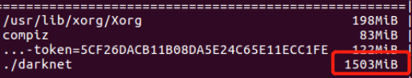Exp27: 1503MB|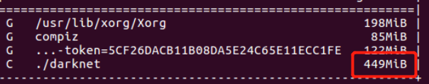Exp26: 449MB|
|Darknet-Cross|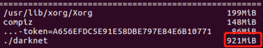Exp12 :921MB|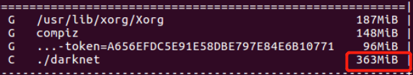Exp11: 363MB|

This table shows the GPU usage when using YOLO-V3 and YOLO-V3-Tiny to process Test1.mp4 Video Data in two frameworks. It can be concluded that **Darknet-Cross uses less GPU memory during execution**, which proves the lightweight characteristic.

### 4.3 Process Speed Comparation

#### 4.3.1 Test on Video

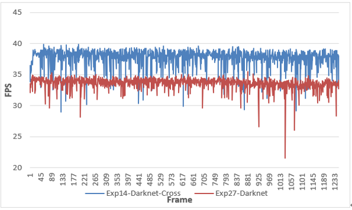

This image shows the FPS when using YOLO-V3 model to process Test1.mp4 Video Date in two frameworks. It can be concluded that **Darknet-Cross has a higher FPS during execution, which proves its light weight feature**.

#### 4.3.2 Test on Single Image 

|Version|Darknet-Cross(second)|Darknet(second)|Difference Value(second)|Increase Rate(%)|
|:--:|:--:|:--:|:--:|:--:|
|V3-Tiny-CPU|0.854647|1.626862|0.772215|47.46653373|
|V3-Tiny-CUDA|0.004042|0.004149|0.000107|2.578934683|
|V3-CPU|9.126586|19.027259|9.900673|52.03415269|
|V3-CUDA|0.027233|0.025488|-0.001745|-6.846359071|

As shown in this table:

-  The processing speed of Darknet-Cross on the CPU is significantly improved compared to the original Darknet. 
-  Darknet and Darknet-Cross can predict a single image very quickly due to the CUDA acceleration when testing on the NVIDIA GTX1070 GPU, so the difference between the CUDA version in two frameworks is very weak. 
-  The results of the CPU version have proven that **Darknet-Cross is a lightweight, high-speed framework compared to Darknet**.

## 5. Multi-Platform Test (Different Verions Comparation in Darknet-Cross)

This chapter is designed to test the performance of different versions in Darknet-Cross.

The following results will demonstrate Darknet-Cross supports multi-platform and multi-typies of GPU.

### 5.1 Foreword: Relationship of Prediction Time in Multi-Image and FPS in Video

I've introduced in [2.2 Android Version](https://github.com/huuuuusy/Darknet-Cross/blob/master/introduction/Version.md#22-android-version) that the underlying Android platform lacks software like FFmpeg for decoding video and VideoCapture function cannot be executed due to the lack of the backend. YOLO will return a failed message when executing an instruction to parse the video in Android platform.

A reasonable idea is: to test the Adreno 630 performance, capture the video frame by frame at first to form Multi-Image Data and push it to Android device, then test the performance of Multi-Image Data on the Adreno 630 GPU. The FPS of the video process on Adreno 630 is reflected by the detection time of Multi-Image.

This section will verify the feasibility of using Multi-Image FPS instead of Video FPS through experiments comparation.

Draw the prediction time of each image in Exp1 (Model：YOLO-V3-Tiny, Platform: Ubuntu, Version： OpenCL, Test Data: Test1.mp4 Multi-Image Data):

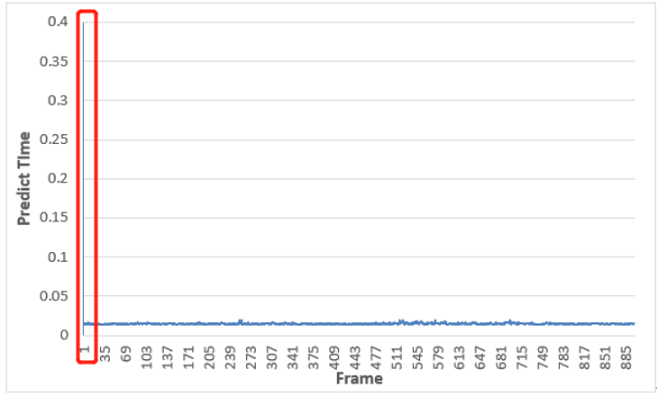

The prediction time of Multi-Image suddenly decreases after the first picture, while each subsequent picture can be stably predicted in a shorter time from the second picture. After deleting the prediction time of the first image, it is clear that the prediction time in following images is stable, and the average prediction time can nearly keep constant.

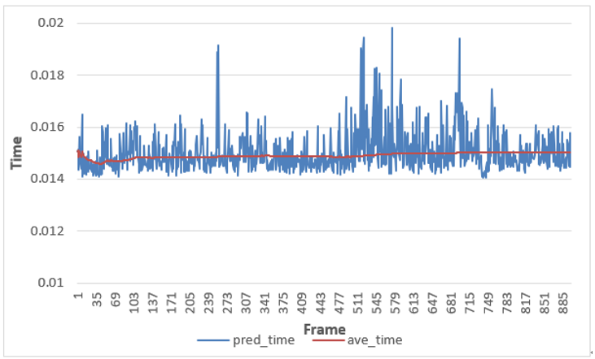

Analysis of Darknet's workflow shows that the program needs to read the configuration information of YOLO-V3 or YOLO-V3-Tiny from the configuration file and weight file during the first execution, and then reconstruct the model based on the Darknet framework. Once the reconstruction is complete, there is no need to repeat the process of model building in the following images. 

Thus, the workflow of Darknet and Darknet-Cross in Video/Multi-Image data processing is as follows:

- Initialize the program, read the model configuration file and weights, and reproduce the model (define this part of the time: model download time)
- Start processing the first image, complete the prediction, and return the time (the time shown here is model download time + actual image prediction time), so the time returned by object detection in single image version is the sum of the two parts
- For video or Multi-Image, read the next frame for continuous high-speed object detection. The predicted time returned by each frame is the real object detection time for a single frame in this stage. Define this part of time as: actual image prediction time

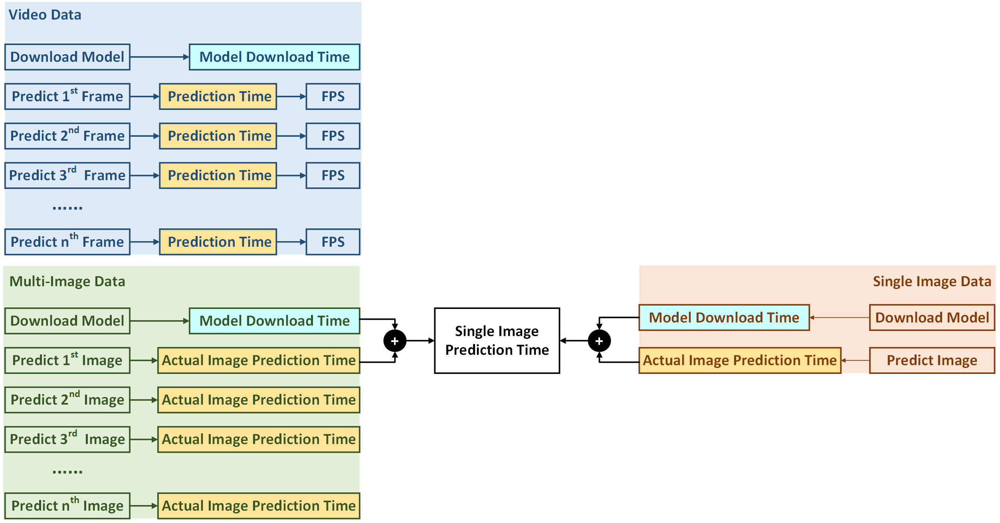

**The prediction time ( = 1/FPS) in video data is equal to actual image prediction time in image data.** Now using the following results to verify the conclusion.

#### 5.1.1 Test on YOLO-V3-Tiny

|Data|Multi-Image|Video|
|:--:|:--:|:--:|
|Test1.mp4|Exp1|Exp4|
|Test2.mp4|Exp2|Exp5|
|Test3.mp4|Exp3|Exp6|

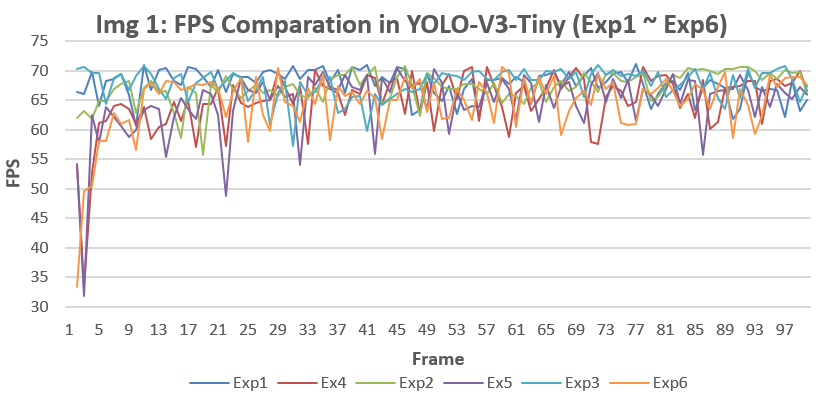

#### 5.1.2 Test on YOLO-V3

|Data|Multi-Image|Video|
|:--:|:--:|:--:|
|Test1.mp4|Exp7|Exp8|

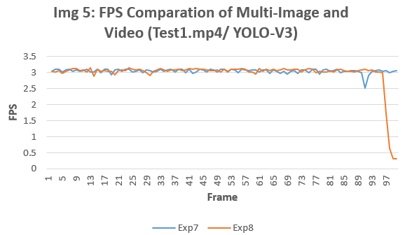

#### 5.1.3 Conclusion

- **The prediction time in video data is equal to actual image prediction time in image data.** The FPS ( = 1/actual image prediction time) of each frame is nearly same when the same video file passes through Darknet-Cross as Multi-Image or video. 

- **The Multi-Image Data can be used instead of Video Data for Darknet-Cross to solve the problem that Android cannot invoke OpenCV to decode video.**

### 5.2	Multi-Platform Process Speed Comparation

This section will test the performance of Darknet-Cross in different platforms by using a series of experiments on Ubuntu 16.04 and Android 8.1. The 16 experiments covered in this section are divided into Group1 ~ Group8 for comparison.

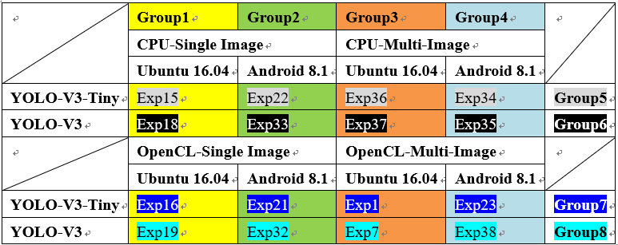

#### 5.2.1 Compare Group1 & Group2 (Single Image: Ubuntu vs. Android)

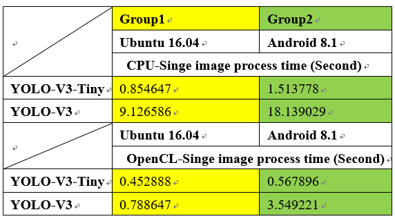

We can get some obvious conclusions:

- The FPS of YOLO-V3-Tiny is higher than YOLO-V3
- Darknet-Cross is faster on Ubuntu 16.04 than on Android 8.1
- OpenCL version is faster than CPU version

Since the model download time and the actual image prediction time are included in the above result, thus we need to delete the model download time (this time is not related to GPU performance) and compare the actual image prediction time. 

To better represent the actual image prediction time, a comparison between Group3 and Group4 is performed.

#### 5.2.2 Compare Group3 & Group4 (Multi-Image: Ubuntu vs. Android)

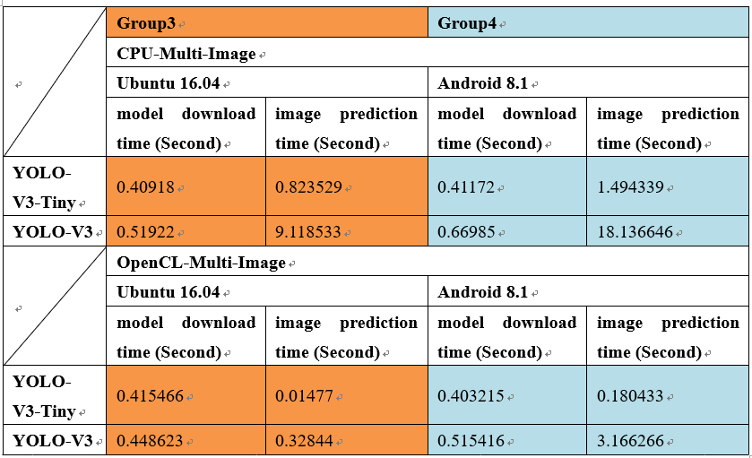

- **The model download time is basically the same under different conditions**, because the model download phase is executed on the CPU and does not activate the OpenCL kernel, so it is not affected by the version

##### Compare CPU Version

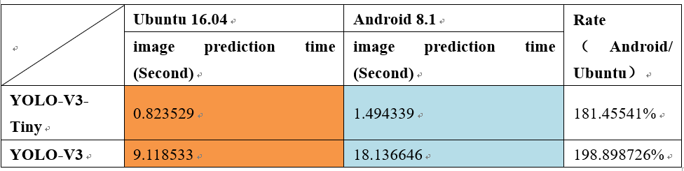

- **For CPU versions, the actual image prediction time on Android 8.1 (Kryo 385 CPU) is about twice than the Ubuntu 16.04 (Intel Core i7-7700 HQ CPU)**

##### Compare GPU Version

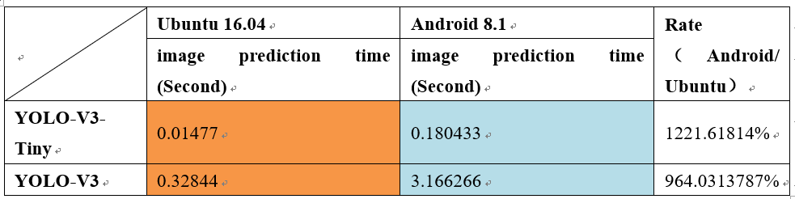

- **For GPU versions, the actual image prediction time used by Darknet-Cross on Android 8.1 (Adreno 630 GPU) is approximately 10 times that of Ubuntu 16.04 (NVIDIA GTX1070 GPU)**

**The OpenCL version runs faster than the CPU version on different platforms, proving that OpenCL invokes GPU for acceleration.** To better prove the effect of OpenCL acceleration, compare the result of Group5 & Group7, Group6 & Group8

#### 5.2.3 Compare Group5 & Group7 and Group6 & Group8 (Verify OpenCL Acceleration)

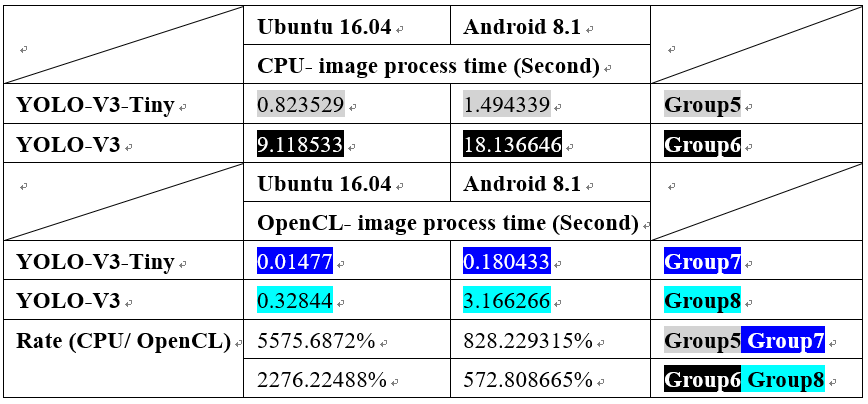

- The OpenCL version takes much less time than the CPU version under different test conditions, which proves that **OpenCL version can provide acceleration support for different computing platforms and different types of GPUs.**
- **For Ubuntu platform, the OpenCL version provides 55.75 times acceleration than CPU version by using YOLO-V3-Tiny, and provides 22.76 times acceleration by using YOLO-V3.**
- **For Android platform, the OpenCL version provides 8.28 times acceleration than CPU version by using YOLO-V3-Tiny, and provides 5.72 times acceleration by using YOLO-V3.**

#### 5.2.4 Compare Latency in Different Version

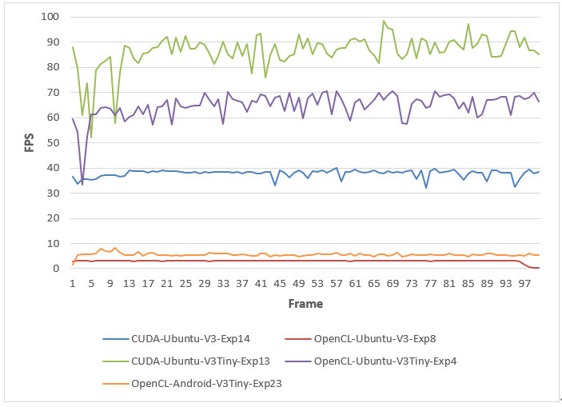

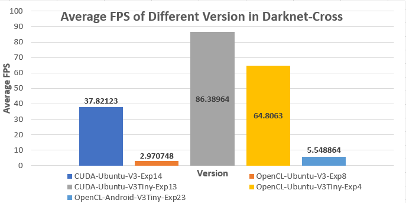

These two images have the same meaning and here are the conclusions (**Since latency is determined by FPS and FPS is heavily influenced by the hardware platform, the specific value of this experiment is for reference only. Please pay attention to the multiple relationship rather than the value itself**):

- **For model comparation: YOLO-V3-Tiny has a higher FPS than YOLO-V3**, so YOLO-V3-Tiny is more suitable for real-time processing when considering the factor of latency
- **For different platforms: the OpenCL version in GTX1070 can provide 64.8 FPS while can provide 5.5 FPS in Adreno 630.**
- **For Adreno 630: Android 8.1 invoke the Adreno 630 GPU and gets 5.5FPS on Test1.mp4.** Although the latency requirement for real-time processing has not been satisfied (FPS>=10), it can be used in applications with no requirement in latency.

