# 2. Cross-compiling Environment Configuration  for Android 8.1.0

## 2.1 Cross-compiling Configuration

A [cross compiler](https://en.wikipedia.org/wiki/Cross_compiler) is a compiler capable of creating executable code for a platform other than the one on which the compiler is running.

In this step, we need to accomplish the cross-compiling configuration to make sure the executable file generated in Ubuntu platform can be use in Android.

### 2.1.1 Hardware Setting

My mobile phone is [XIAOMI MI8](https://www.mi.com/global/mi8/), a latest version released in June, 2018. It is based on Qualcomm® Snapdragon™ 845 precessor and uses Adreno 630 GPU, which suits the Darknet-Cross test requirements (Android platform with mobile GPU).

First, the mobile phone should be unlocked and given the root authority to make sure the Ubuntu terminal can manage it by using Android Debug Bridge (adb).

I will use MI 8 as an example, the other mobile phones should finish the same operations based on specific manufacturers.

**(1)Unlock the device:**

**(2)Open the USB management:**

**(3)Make sure the ADB can be used:**

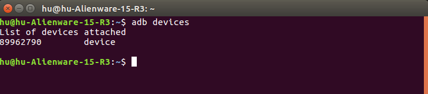

**(4)Download and install the [Root Explorer](https://rootexplorer.co/) apk:**

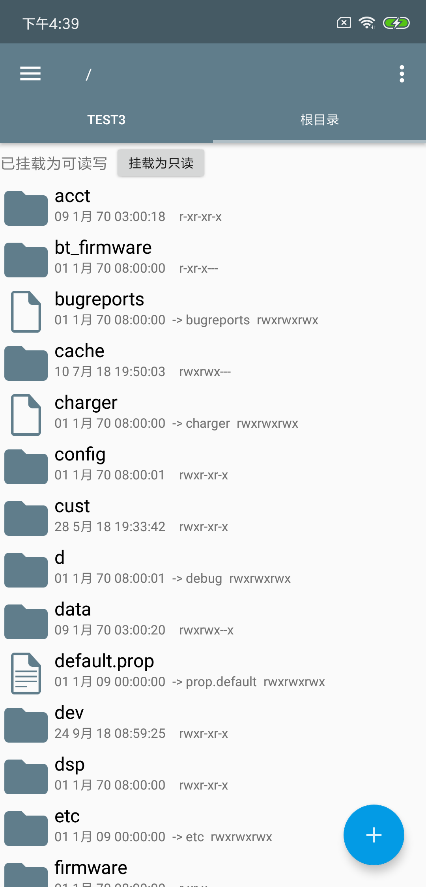

Give read and write permissions to the folder to make sure the files can be copied in the root dictionary (Just use the button in top of the Root Explorer).

### 2.1.2 Install Cross-Compiling Toolchain

#### Install NDK

Install NDK package in [official website](https://developer.android.com/ndk/downloads/), then set the environment variables:

	sudo gedit /etc/profile

Add the information:

	export NDK=/media/hu/hu-disk/package/android/ndk/android-ndk-r15c
    export SYSROOT=$NDK/platforms/android-18/arch-arm

***Remember changing the path and version information to suit your own platforms in each step***.

	source /etc/profile

#### Build Toolchain Folder

Open a terminal in /media/hu/hu-disk/package/android/ndk/android-ndk-r15c/build/tools/:

	./make-standalone-toolchain.sh --platform=android-18 --install-dir=/media/hu/hu-disk/package/AndroidToolChain

--platform is the Android version，--install is the path of AndroidToolChain folder. 

#### Set Cross Compiling Environment Veriables

Add following information in /etc/profile:

    export SYSROOT=/media/hu/hu-disk/package/AndroidToolChain/sysroot
    export NDK_CROSS=/media/hu/hu-disk/package/AndroidToolChain/bin
    export PATH=$PATH:$NDK:$NDK_CROSS
    export ANDROIDLIB=$SYSROOT/usr/lib
    export PATH=$PATH:$SYSROOT:/media/hu/hu-disk/package/AndroidToolChain
    export LD_LIBRARY_PATH=$ANDROIDLIB:$LD_LIBRARY_PATH

then run source /etc/profile in terminal.

#### Copy Header File 

	cp /media/hu/hu-disk/package/AndroidToolChain/include/c++/4.9.x/arm-linux-androideabi/armv7-a/bits/* /media/hu/hu-disk/package/AndroidToolChain/include/c++/4.9.x/bits/
    
## Test

Now the cross compiling environment is well deployed. Now run a demo to test it.

Build a file named helloAndroid.cpp, copy the code in this file:

    #include <stdio.h>
    int main()
    {
        printf("hello Andriod \n");
        return 0;
    }
    
Run this command in terminal:

	arm-linux-androideabi-clang++ helloAndroid.cpp -o hello -pie -fPIE

Now use adb push to copy the folder in Android mobile phone (XIAOMI MI8) and test as this image shows:

#### Set Anreno SDK for OpenCL

Download [Adreno SDK-OpenCL](https://developer.qualcomm.com/download/software).

Decompressing the file and copy the /inc/CL folder to /media/hu/hu-disk/package/AndroidToolChain/sysroot/usr/include.

Connect the mobile phone and run adb pull /system/vendor/lib/libOpenCL.so in terminal to copy the libOpenCL.so file.

Copy the libOpenCL.so in /media/hu/hu-disk/package/AndroidToolChain/sysroot/usr/lib.

## 2.2 3rd Parties Compiling

### 2.2.1 OpenCL

The libOpenCL.so is provided by mobile phone manufacturer. Thus you need to download it from mobile phone to PC at first then check the OpenCL version.

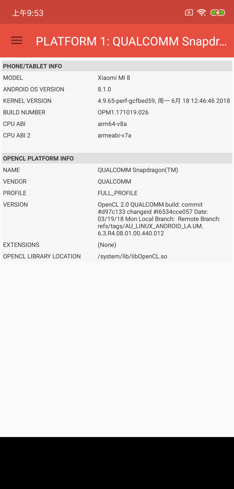

My phone is XIAOMI MI 8, the screenshot provided by [OpenCL-Z](https://play.google.com/store/apps/details?id=com.robertwgh.opencl_z_android&hl=zh). It shows that the OpenCL version is OpenCL 2.0, and the dynamic library is located in /system/lib/libOpenCL.so.

	adb pull /system/lib/libOpenCL.so ~/Desktop

Download the libOpenCL.so library and copy it to 3rdParty/Android/OpenCL folder.

Now you need to download the header files of OpenCL from [Khronos OpenCL-Headers](https://github.com/KhronosGroup/OpenCL-Headers) and copy the CL folder to 3rdParty/Android/OpenCL.

What's more, you need to Compile for a Specific OpenCL Version. By default, the OpenCL API headers in this repository are for the latest OpenCL version (currently OpenCL 2.2). To use these API headers to target a different OpenCL version, an application may #define the preprocessor value CL_TARGET_OPENCL_VERSION before including the OpenCL API headers. The CL_TARGET_OPENCL_VERSION is a three digit decimal value representing the OpenCL API version.

In this project, I have changed the default version as OpenCL 2.0 by using #define CL_TARGET_OPENCL_VERSION 200 in cl_version.h file.

**Attention: The libOpenCL.so and the header files version should be consistent. Thus it is important to check your mobile phone GPU version and OpenCL version at first. If your device supports OpenCL 2.0, you do not need to change the CL folder in 3rdParty/Android/OpenCL folder. However, you need to replace the libOpenCL.so to your own device if your mobile phone is not XIAOMI MI 8.**

### 2.2.2 CLBlast

I've set the Android version CLBlast library in 3rdParty/Android/CLBlast folder. If your mobile phone has the same architerture with XIAOMI MI8 (armeabi-v7a), you can use it directly. 

However, it's better to accomplish the following cross-compiling steps by yourself to make sure the library can be used correctly.

#### Cross Compiling

Download the source code in [CLBlast](https://github.com/CNugteren/CLBlast).

Obey the [installation instruction](https://github.com/CNugteren/CLBlast/blob/master/doc/installation.md) for Android  Platform.

Choose the second method: cross-compile the library and the test/client/tuner executables directly. To do so, first finishing all the steps in Cross Compiling Environment in Ubuntu 16.04 correctly, then in the CLBlast source code folder, invoke CMake as follows:

	mkdir build && cd build
    
	cmake .. -DCMAKE_SYSTEM_NAME=Android  -DCMAKE_SYSTEM_VERSION=18 -DCMAKE_ANDROID_ARCH_ABI=armeabi-v7a -DCMAKE_ANDROID_NDK=/media/hu/hu-disk/package/android/ndk/android-ndk-r15c -DCMAKE_ANDROID_STL_TYPE=gnustl_static -DOPENCL_ROOT=/media/hu/hu-disk/package/AndroidToolChain/sysroot/usr/lib

	make

#### Test on Adreno 630

Now connect the mobile phone (XIAOMI MI 8 with Adreno 630) and run:

	adb root 
	adb push /media/hu/hu-disk/code/YOLO-openCL/CLBlast-android/build /MSC

Select an executable file and test on Adreno 630:

I've mainly tested clblast_tuner_xdot, clblast_tuner_copy_fast and clblast_tuner_xgemm.

||clblast_tuner_xdot|clblast_tuner_copy_fast|clblast_tuner_xgemm|
|:--:|:--:|:--:|:--:|
|Command|./clblast_tuner_xdot|./clblast_tuner_copy_fast|./clblast_tuner_xgemm -m 256 -n 256 -k 256 -num_steps 4 -step 256|
|Result| ||   |

### 2.2.3 OpenCV (Not used in this stage)

I've explained in [Android Version](https://github.com/huuuuusy/Darknet-Cross/blob/master/introduction/Version.md#22-android-version) that the Android platform does not support using VideoCapture class directly since it lacks video decoder like FFmpeg. Thus, the OpenCV libraries is not included in Android version now.

However, I will still list the cross-compiling steps for OpenCV here and update this part once I find a better solution to solve the problem.
#### Tools

**SDK Tools: tools_r25.2.5-linux**

**NDK Tools: android-ndk-r16b-linux-x86_64**

**OpenCV: 3.4.0**

Compiling OpenCV directly may failed like [#Issue 11185](https://github.com/opencv/opencv/issues/11185) since OpenCV doesn't support Android gradle builds at this moment.

According to [#Issue 8460](https://github.com/opencv/opencv/issues/8460), the correct process is as following:

#### Download SDK Tools

Based on [#Issue 8460](https://github.com/opencv/opencv/issues/8460), OpenCVDetectAndroidSDK.cmake doesn't detect an Android SDK after updating to the SDK Tools, Revision 25.3.0. Current solution is to downgrade SDK Tools to the latest available version prior 25.3.0: 25.2.5. Direct download links are:

https://dl.google.com/android/repository/tools_r25.2.5-linux.zip (265Mb)
https://dl.google.com/android/repository/tools_r25.2.5-macosx.zip (191Mb)
https://dl.google.com/android/repository/tools_r25.2.5-windows.zip (293Mb)

	mkdir sdk && cd sdk
    wget https://dl.google.com/android/repository/tools_r25.2.5-linux.zip && unzip tools_r25.2.5-linux.zip
    tools/android sdk

Select and install the following two packages:

**Android SDK Build-tools 27.0.3**

**Android 8.1.0 (API 27) -> SDK Platform 27**

#### Download OpenCV

This command will download the newest version of OpenCV (3.4.0):

	mkdir opencv && cd opencv
    git clone https://github.com/opencv/opencv.git

Now we need to install android-ant to avoid **ninja: error: unknown target 'opencv_engine'** error.

    cd ~/opencv/opencv
    wget https://gist.githubusercontent.com/ngriffiths/296e2fc16b8586705712d50bdfe746b0/raw/350a8cb6497bfe367dda75b7bb202d6c7ce09a72/always-use-ant__find_android.patch && git apply always-use-ant__find_android.patch

#### Download NDK

Download a NDK version from [here](https://developer.android.com/ndk/downloads/?hl=zh-cn), I've selected the r16b version. (Do not select the newest version, which may occur some errors)

#### Cross Compiling -- Static Library

In OpenCV main folder:

	mkdir build && cd build

Now verify the path of:

CMAKE_TOOLCHAIN_FILE = /media/hu/hu-disk/test/opencv/opencv/platforms/android/android.toolchain.cmake

ANDROID_NDK = /media/hu/hu-disk/test/opencv/android-ndk-r16b 

ANDROID_SDK = /media/hu/hu-disk/test/opencv/sdk

ANDROID_HOME = /media/hu/hu-disk/test/opencv/sdk

You should change the path to your own file.

**If you select the OpenCV 3.4.0, you can use the command below directly. If you select OpenCV 3.3.0, you should change:**

**1. Use the android.toolchain.cmake file in OpenCV 3.4.0 rather than the original file in OpenCV 3.3.0**

**2. Change the ABI information as below in build_sdk.py:**

**ABIs = [
    ABI("2", "armeabi-v7a", "arm-linux-androideabi-4.9", cmake_name="armeabi-v7a with NEON"),
    ABI("1", "armeabi",     "arm-linux-androideabi-4.9"),
    ABI("3", "arm64-v8a",   "aarch64-linux-android-4.9"),
    ABI("5", "x86_64",      "x86_64-4.9"),
    ABI("4", "x86",         "x86-4.9"),
    ABI("7", "mips64",      "mips64el-linux-android-4.9"),
    ABI("6", "mips",        "mipsel-linux-android-4.9")
]**

The cross compiling command is:

	cmake -DCMAKE_TOOLCHAIN_FILE=/media/hu/hu-disk/test/opencv/opencv/platforms/android/android.toolchain.cmake -DANDROID_NDK=/media/hu/hu-disk/test/opencv/android-ndk-r16b -DANDROID_SDK=/media/hu/hu-disk/test/opencv/sdk -DANDROID_HOME=/media/hu/hu-disk/test/opencv/sdk -DCMAKE_BUILD_TYPE=Release  -DANDROID_ABI=armeabi -DANDROID_NATIVE_API_LEVEL=27 ..
	make -j 8

The generate static libraries are as following:

#### Cross Compiling -- Dynamic Library

Add -DBUILD_SHARED_LIBS=1 in command to build the dynamic library:

	cmake -DCMAKE_TOOLCHAIN_FILE=/media/hu/hu-disk/test/opencv-so/opencv-3.3.0/platforms/android/android.toolchain.cmake -DANDROID_NDK=/media/hu/hu-disk/test/opencv/android-ndk-r16b -DANDROID_SDK=/media/hu/hu-disk/test/opencv/sdk -DBUILD_SHARED_LIBS=1 -DANDROID_HOME=/media/hu/hu-disk/test/opencv/sdk -DCMAKE_BUILD_TYPE=Release  -DANDROID_ABI=armeabi -DANDROID_NATIVE_API_LEVEL=27 ..

The generate static libraries are as following:

**The generated OpenCV dynamic libraries are uploaded in [OpenCV-Dynamic-Library](https://github.com/huuuuusy/YOLO-Learning-Notes/tree/master/OpenCV-Dynamic-Library) folder.**

## 2.3 Android-CPU Version

### [Demo:【Darknet-Cross User Guide】4. Android-CPU Version](https://www.youtube.com/watch?v=l9-g7vx8Hs0)

Open Makefile and set the ANDROID_CPU = 1 while keep the others to 0.

The following step is the same as the UBUNTU-CUDA version.

	make clean
    make

The generated darknet executable file will be generated in bin folder.

#### Test Single Image

Copy the darknet file to the android_test/Darknet_cross folder.

    cp bin/darknet android_test/Darknet_cross/darknet

Now use adb to push the files in Android device.

	adb root
	adb shell
	mkdir Darknet_cross

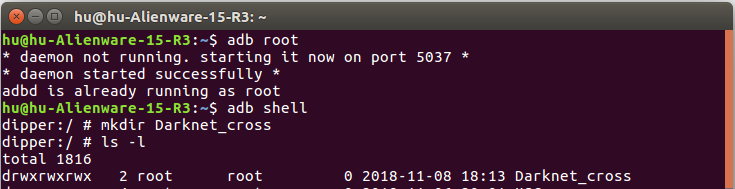

The android_test/Darknet_cross folder includes the files used in execution.

	adb push android_test/Darknet_cross /Darknet_cross

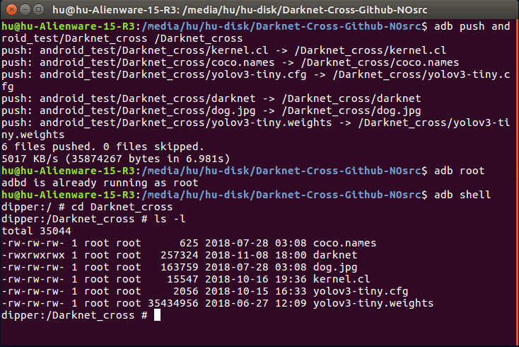

The bin/data folder will be used in prediction (draw the name of prediction results in image), thus push it to Darknet_cross folder in Android.

	adb push bin/data /Darknet_cross/data

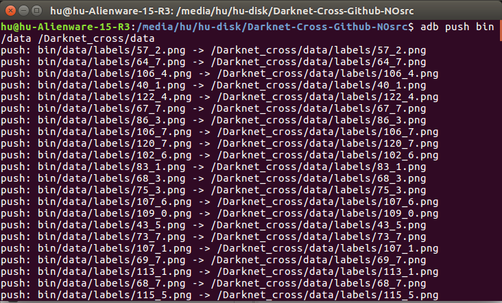

Now test the image prediction in Android.

	adb shell
    cd Darknet_cross
    ./darknet detector test coco.names yolov3-tiny.cfg yolov3-tiny.weights -thresh 0.24 dog.jpg

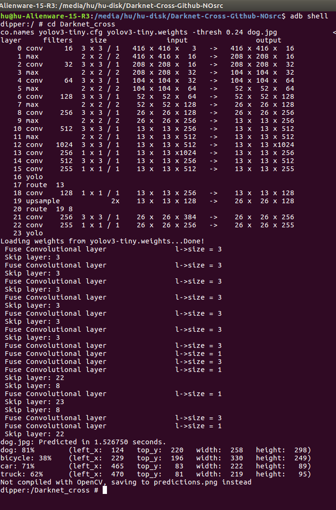

## 2.4 Andorid-OpenCL Version

### [Demo:【Darknet-Cross User Guide】5. Android-OpenCL Version](https://www.youtube.com/watch?v=wfl1E0TAf_g&t=48s)

Open Makefile and set the ANDROID_OPENCL = 1 while keep the others to 0.

The following step is the same as the UBUNTU-CUDA version.

	make clean
    make

The generated darknet executable file will be generated in bin folder.

#### Test Single Image

Copy the darknet file to the android_test/Darknet_cross folder.

    adb push bin/darknet /Darknet_cross

The android_test/Library folder includes the libraries used in execution.

	adb push android_test/Library /system/bin

Now test the image prediction in Android.

	adb shell
    cd Darknet_cross
    ./darknet detector test coco.names yolov3-tiny.cfg yolov3-tiny.weights -thresh 0.24 dog.jpg

The opencl information will be printed at the begining.

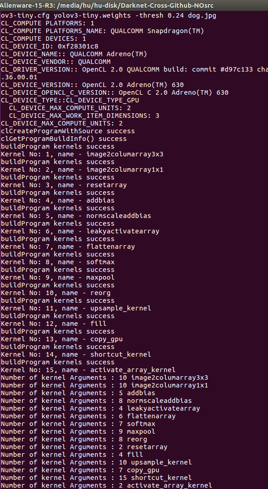

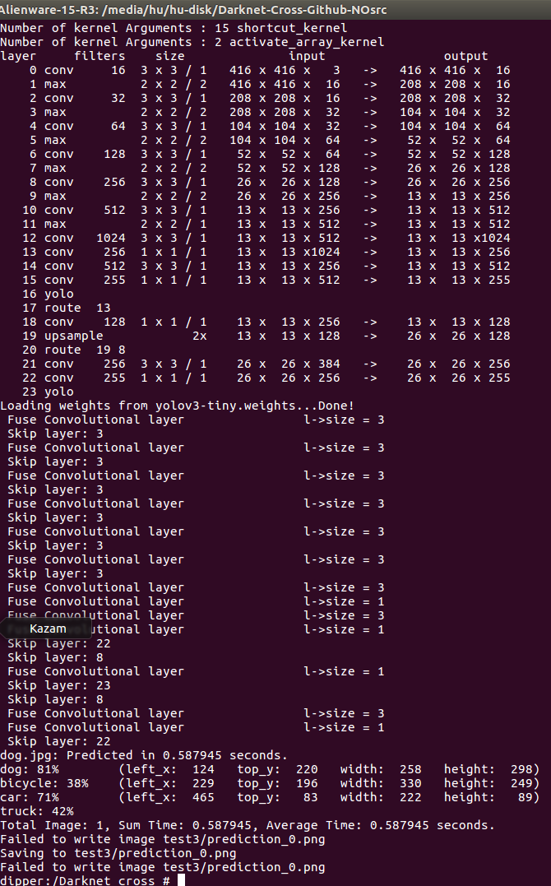

#### Test Multi-Image

	adb push bin/test3 /Darknet_cross/test3

Test3 folder is used to test the multi-image prediction in Android.

	adb shell
    cd Darknet_cross
    ./darknet detector test coco.names yolov3-tiny.cfg yolov3-tiny.weights

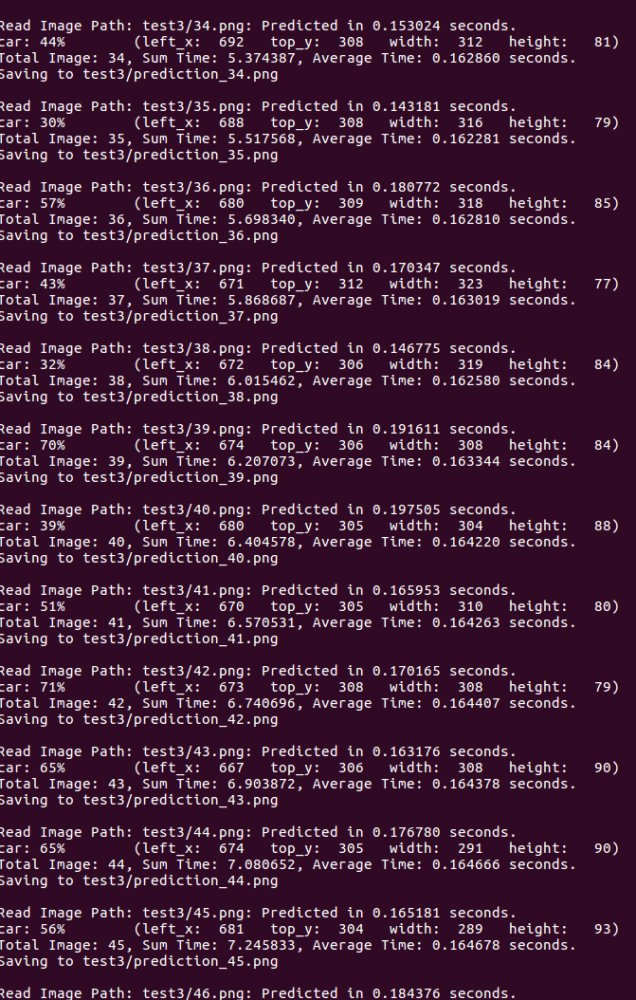

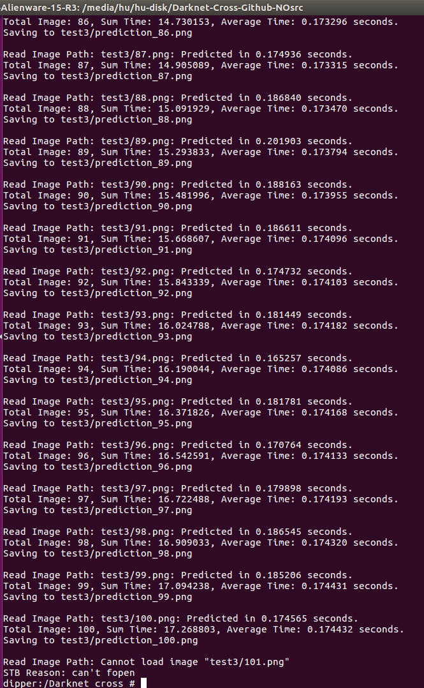

The average time of multi-image prediction is about 0.175 second in Adreno 630. More information and performance will be listed in [V. Darknet-Cross Performance](https://github.com/huuuuusy/Darknet-Cross/blob/master/introduction/Performance.md).