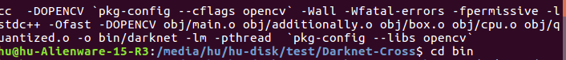
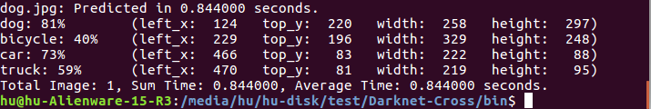
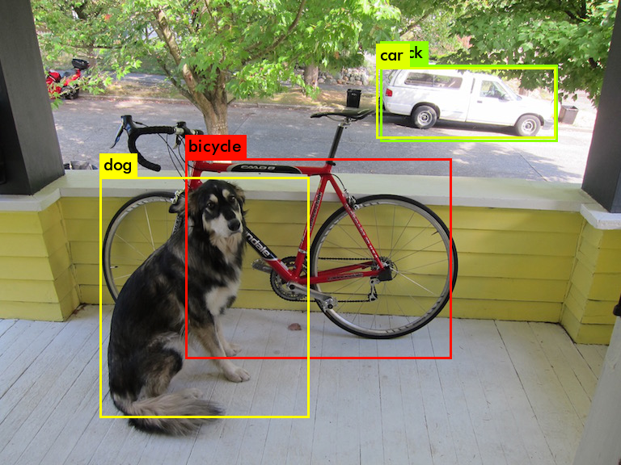
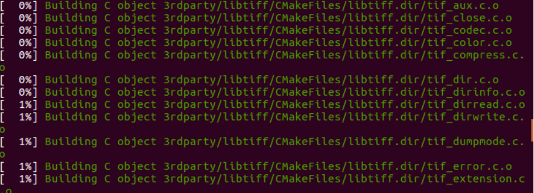
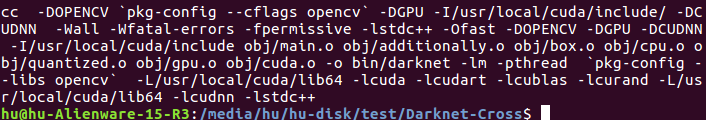
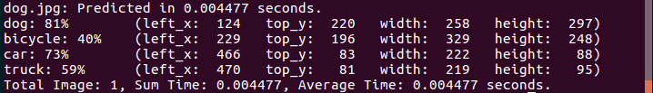
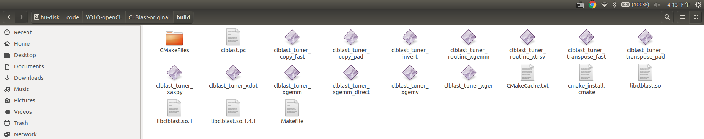
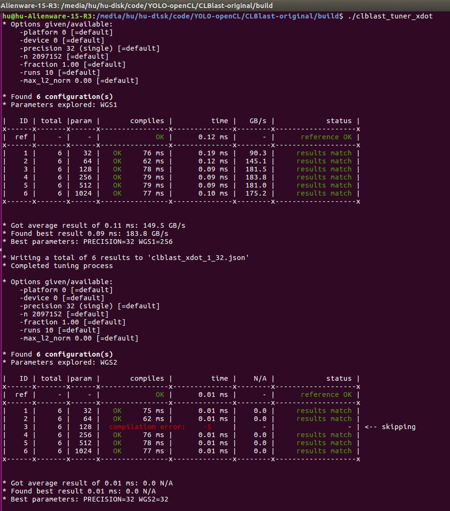
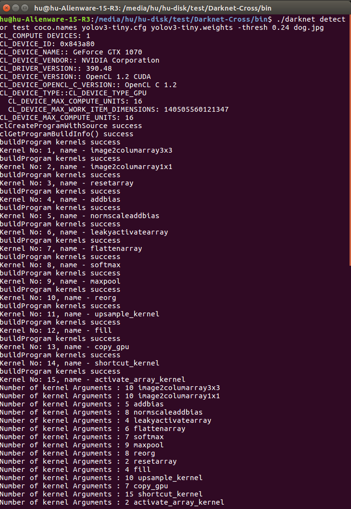
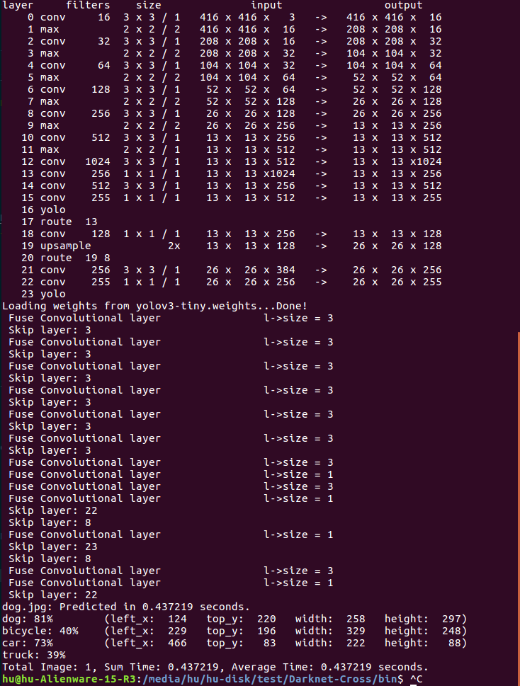

# 1. Environment Configuration in Ubuntu 16.04

## 1.1 Ubuntu-CPU Version

### [Demo:【Darknet-Cross User Guide】 1. Ubuntu-CPU Version](https://www.youtube.com/watch?v=D7c89kU0FXk)

First, compile the ubuntu-cpu version for test. 

Clone the Darknet-Cross project in Github:

    git clone https://github.com/huuuuusy/Darknet-Cross.git

Open Makefile and set the UBUNTU_CPU = 1 while keep the others to 0.

	make clean
    make

The generated darknet executable file will be generated in bin folder.

	cd bin
	./darknet detector test coco.names yolov3-tiny.cfg yolov3-tiny.weights -thresh 0.24 dog.jpg

## 1.2 Ubuntu-CUDA Version

### 1.2.1 Deep Learning Environment Setting

#### 1. Install Nvidia Driver

Make sure the version of Nvidia driver from the [office webiste](http://www.nvidia.com/Download/index.aspx?lang=cn), then obey the steps released in Part2.4--Nvidia Driver  in [my blog](https://blog.csdn.net/huuuuusy/article/details/78008195).

	nvidia-smi

#### 2. Install CUDA

To make sure the CUDA vision is currect, it's better to uninstall the old vision and install the new version.

	sudo /usr/local/cuda-9.0/bin/uninstall_cuda_9.0.pl

Then download the CUDA from [office website](https://developer.nvidia.com/cuda-downloads
). I select CUDA 9.0.

***Attention: the Nvidia driver with CUDA(384.81) is older than the version we've installed in step1(390.25), thus do not accept to install Nvidia driver with cuda in the installatiion process.***

	sudo sh cuda_9.0.176_384.81_linux.run

After installation, type the following commands in terminal:

	sudo gedit /etc/profile

Add the following information in last line:

	export PATH=/usr/local/cuda-9.0/bin:$PATH  
	export LD_LIBRARY_PATH=/usr/local/cuda-9.0/lib64:$LD_LIBRARY_PATH

Save and type:

	sudo ldconfig

Then type commands in terminal:

	sudo gedit ~/.bashrc

Add the following information in last line as well:

	export PATH=/usr/local/cuda-9.0/bin:$PATH  
	export LD_LIBRARY_PATH=/usr/local/cuda-9.0/lib64:$LD_LIBRARY_PATH****

Then type commands in terminal:
	
	source ~/.bashrc

Now check in terminal:

	nvcc -V

Test an example:

	cd /NVIDIA_CUDA-9.0_Samples/1_Utilities/deviceQuery
	sudo make all
	./deviceQuery

#### 3. Install Cudnn

Download cudnn from [office website](https://developer.nvidia.com/cudnn).

Uncompress the file and open a terminal in the cuda folder.

	sudo cp lib64/* /usr/local/cuda/lib64/
	sudo cp include/* /usr/local/cuda/include/
	sudo chmod 777 /usr/local/cuda/lib64/
	sudo chmod 777 /usr/local/cuda/include/

***Avoiding the following step shows errors like cannot find libcudart, it is better to add 3 more commends here:***

	sudo cp /usr/local/cuda-9.0/lib64/libcudart.so.9.0 /usr/local/lib/libcudart.so.9.0 && sudo ldconfig
	sudo cp /usr/local/cuda-9.0/lib64/libcublas.so.9.0 /usr/local/lib/libcublas.so.9.0 && sudo ldconfig
	sudo cp /usr/local/cuda-9.0/lib64/libcurand.so.9.0 /usr/local/lib/libcurand.so.9.0 && sudo ldconfig

#### 4. Install Tensorflow

It is easy to install the GPU version tensorflow:

	conda create -n tensorflow
	source activate tensorflow
	pip install tensorflow-gpu

Now can test it by using:

	python
	import tensorflow as tf

### 1.2.2 OpenCV-3.4.0 Installation

Download OpenCV-3.4.0 from the [office website](https://opencv.org/releases.html).

	unzip opencv-3.4.0.zip

Open the unpacked package.

	sudo apt-get install cmake
    sudo apt-get install build-essential libgtk2.0-dev libavcodec-dev libavformat-dev libjpeg.dev libtiff4.dev libswscale-dev libjasper-dev 

Make a build folder.

	mkdir my_build_dir
	cd my_build_dir
    cmake -D CMAKE_BUILD_TYPE=Release -D CMAKE_INSTALL_PREFIX=/usr/local ..
	sudo make

It may need 2 hours to finish the compiling (depends on the specific commands used in cmake process).

	sudo make install

After the compilation is complete, the next step is to configure some OpenCV build environment. First add the OpenCV library to the path file.

	sudo gedit /etc/ld.so.conf.d/opencv.conf 
    
After using this command, it may openbe a blank file,  just add at the following information in the end of the file.

	/usr/local/lib  

Then open terminal and type:

	sudo ldconfig 

If there occurs some error information about libEGL.so.1, just type:

sudo mv /usr/lib/nvidia-390/libEGL.so.1 /usr/lib/nvidia-390/libEGL.so.1.org 
sudo mv /usr/lib32/nvidia-390/libEGL.so.1 /usr/lib32/nvidia-390/libEGL.so.1.org 
sudo ln -s /usr/lib/nvidia-390/libEGL.so.390.48 /usr/lib/nvidia-390/libEGL.so.1 
sudo ln -s /usr/lib32/nvidia-390/libEGL.so.390.48 /usr/lib32/nvidia-390/libEGL.so.1

**The version number in these commands should suits your own Nvidia driver version, please check it in /usr/lib folder.**

Now set the bash file:

	sudo gedit /etc/bash.bashrc 

And add these information in the end of bash:

	PKG_CONFIG_PATH=$PKG_CONFIG_PATH:/usr/local/lib/pkgconfig  
	export PKG_CONFIG_PATH  

Then type:

	source /etc/bash.bashrc
    sudo updatedb 

To test the compiling result, just open the OpenCV source code folder and compile an example:

	cd opencv-3.4.0/samples/cpp/example_cmake
    cmake .
    make
    ./opencv_example

This is a small program to open the camera, and hello opencv will appera on the top of the camera frame.

### 1.2.3 Ubuntu-CUDA Version Compile

### [Demo:【Darknet-Cross User Guide】2. Ubuntu-CUDA Version](https://www.youtube.com/watch?v=Z-wjtzzIN7I)

Open Makefile and set the UBUNTU_CUDA = 1 while keep the others to 0.

	make clean
    make

The generated darknet executable file will be generated in bin folder.

#### Test Single Image

	cd bin
	./darknet detector test coco.names yolov3-tiny.cfg yolov3-tiny.weights -thresh 0.24 dog.jpg

#### Test Video

The process command for test1.mp4(from Udacity):

	./darknet detector demo coco.names yolov3-tiny.cfg yolov3-tiny.weights test1.mp4

The process command for test2.mp4(from Videezy):

	./darknet detector demo coco.names yolov3-tiny.cfg yolov3-tiny.weights test2.mp4

## 1.3 Ubuntu-OpenCL Version

### 1.3.1 OpenCL Installation

CUDA library provides cumputation acceleration, but it only supports Nvidia GPU. Thus, the OpenCL version is designed to support different types of GPUs.

The GPU in my PC is Nvidia GTX1070. Since I've installed CUDA9.0, the OpenCL is also installed in my PC with CUDA.

	clinfo

Use clinfo command to list the OpenCL information, it is clear that my Nvidia Driver is 390.48, and I've installed OpenCL 1.2 with CUDA.

In fact, I've assigned the path of OpenCL folder in Makefile. However, it only suits the OpenCL based on CUDA.(For no-Nvidia GPUs which only installing OpenCL needs to change the path)

    ifeq ($(U_OPENCL), 1) 
    COMMON+= -DOPENCL -I./src/Ubuntu/include -I/usr/local/cuda/include -I./src/Ubuntu
    CFLAGS+= -DOPENCL
    LDFLAGS+= -L/usr/local/cuda/lib64 -lOpenCL 
    endif

**Please make sure the path in Makefile is the same as your OpenCL path.**

### 1.3.2 CLBlast Installation

[CLBlast](https://github.com/CNugteren/CLBlast) is a modern, lightweight, performant and tunable OpenCL BLAS library written in C++11. It is designed to leverage the full performance potential of a wide variety of OpenCL devices from different vendors, including desktop and laptop GPUs, embedded GPUs, and other accelerators.

I've finished the compiling process in Ubuntu 16.04 and set the libraries and header files in 3rdParty folder. The path of these files are also assigned in Makefile.

    ifeq ($(U_CLBLAST), 1) 
    COMMON+= -DCLBLAST -I./3rdParty/Ubuntu/CLBlast/include 
    CFLAGS+= -DCLBLAST
    LDFLAGS+= -L./3rdParty/Ubuntu/CLBlast -lclblast 
    endif

If your system is Ubuntu 16.04, you can use the CLBlast libraries directly. 

If you want to compile CLBlast by yourself, please following the steps below:

(1)Download the source code from [CLBlast](https://github.com/CNugteren/CLBlast) and read the README file for more information.

(2)Open a terminal in main folder and type:

    mkdir build && cd build
    cmake ..
    make
    
For any questions in this step, please read [CLBlast: Building and installing](https://github.com/CNugteren/CLBlast/blob/master/doc/installation.md).

(3)You can test the examples in build folder to verify the compiling result.

### 1.3.3 Ubuntu-OpenCL Version Compile

### [Demo:【Darknet-Cross User Guide】3. Ubuntu-OpenCL Version](https://www.youtube.com/watch?v=UwaMubGUVbU)

Open Makefile and set the UBUNTU_OPENCL = 1 while keep the others to 0.

The following step is the same as the UBUNTU-CUDA version.

	make clean
    make

The generated darknet executable file will be generated in bin folder.

#### Test Single Image

	cd bin
	./darknet detector test coco.names yolov3-tiny.cfg yolov3-tiny.weights -thresh 0.24 dog.jpg

The OpenCL information about device and platform will be printed at the beginning.

The prediction time is shorter than the UBUNTU-CPU version but longer than the UBUNTU-CUDA version.

#### Test Video

The process command for test1.mp4(from Udacity):

	./darknet detector demo coco.names yolov3-tiny.cfg yolov3-tiny.weights test1.mp4

The video process steps are the same as UBUNTU-CUDA version expect the FPS value in prediction. More analysis and results will be listed in [IV. Darknet-Cross Performance](https://github.com/huuuuusy/Darknet-Cross/blob/master/introduction/Performance.md).